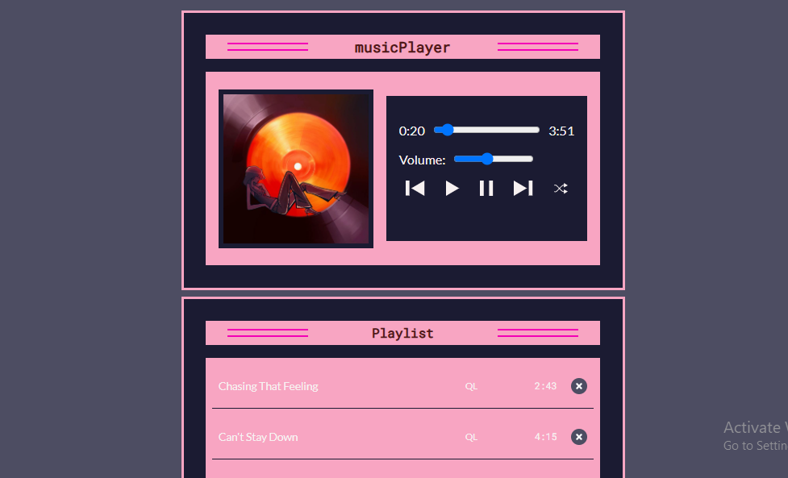

# 🎵 Music Player

A simple yet stylish **Music Player** built with **HTML, CSS, and JavaScript**.  
It allows you to play, pause, skip, shuffle, and delete songs dynamically — all in a responsive, clean interface.

---

## ✨ Features

- 🎶 Play / Pause songs  
- ⏭️ Next / Previous track controls  
- 🔀 Shuffle songs randomly  
- 🔊 Adjustable volume control  
- ⏱️ Progress bar with current time and duration  
- 🗑️ Delete songs from the playlist  
- 📱 Fully responsive design  
- ⚡ Auto-play next track  

---

## 🛠️ Tech Stack

- **HTML5**
- **CSS3**
- **JavaScript (Vanilla)**

---

## 📂 Folder Structure

CodeAlpha_MusicPlayer/
│
├── index.html # Main HTML structure
├── styles.css # Styling and layout
└── script.js # Music player logic

## 🚀 Live Demo
🔗 [Live Demo](https://musicplayern.netlify.app/)  

---

## 💻 GitHub Repository
🔗 [GitHub Repo](https://github.com/kal1kidan/codealpha_MusicPlayer)

---
## 📸 Sneak Peek
  

---
